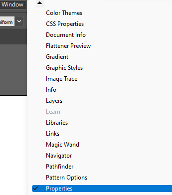

 

**Panel Properties** di Illustrator memungkinkan kita untuk melihat pengaturan dan kontrol dalam konteks tugas atau alur kerja. Panel ini telah dirancang dengan mempertimbangkan kemudahan penggunaan, memastikan bahwa kita dapat mengakses ke kontrol yang tepat saat kita membutuhkannya.

Panel Properties tersedia secara default di ruang kerja Essentials. Panel ini juga dapat di akses melalui **Toolbar** ***Windows -> Properties***.
  

 
Kontrol yang sering digunakan untuk setiap area panel Properties ditampilkan di muka. Kita dapat mengakses kontrol tambahan dengan mengklik elips di sudut kanan bawah area atau mengklik opsi yang digarisbawahi.

Panel Properties akan menampilkan menu yang berbeda-beda sesuai dengan tipe object yang dipilih. Berikut beberapa tampilan dari Panel Properties: 

 

### 1. Tampilan Default

Secara default Panel Properties akan menampilkan kontrol untuk *Document, Ruler & Grids, Guides, Snap Options, Preferences,* dan *Quick Actions*. Setiap kontrol tersebut akan memudahkan kita dalam mengatur halaman kerja sesuai dengan yang kita inginkan. Berikut akan dijelaskan fungsi dari masing-masing kontrol tersebut.

**Documents**

Kontrol documents memberi kita akses untuk mengatur units yang kita gunakan pada halaman kerja, beberapa unit yang sering digunakan adalah pixel, poin, millimeter, dan lain-lain. Kemudian kita juga dapat menentukan artboard aktif, bahkan terdapat menu untuk mengaktifkan pengaturan artboards yang lebih lengkap, yaitu pada menu edit artboard.

**Rules & Grids**

Sesuai dengan namanya, kontrol ini memberi kita akses untuk menampilkan penggaris dan beberapa grid yang memudahkan kita dalam melakukan pekerjaan.

**Guides dan Snap Options**

Kedua kontrol ini berfungsi untuk mengaktifkan guide dan juga snap. Snap akan membantu kita untuk merapikan objek atau path sehigga akan otomatis tersejajarkan.

**Preferences**

Kontrol ini terdapat menu Keyboard Increment, Use Preview Bounds, Scale Corners, dan Scale Strokes & Effects.

**Quick Actions**

Kontrol ini akan memberikan akses tambahan pada menu Document Setup dan Preferences yang lebih lengkap.

 

### 2. Tampilan Image & Path

Berbeda dengan tampilan default, Properties pada Tampilan Image & Path hanya menampilkan kontrol *Transform, Appearence,* dan *Quick Actions.* 

**Transform** akan menampilkan menu untuk mengubuah ukuran objek, posisi, dan transformasi.

**Appearence** akan menampilkan menu tampilan seperti, fill, stroke, opacity, dan effect.

 

### 3. Tampilan Type

Tampilan Panel Properties yang lain, seperti Tampilan Type memberikan akses yang lebih banyak. Pada tampilan ini terdapat pengaturan yang menyangkut dengan typing. Pada tampilan ini terdapat kontrol *Transform, Appearence, Character,* dan *Paragraph.*

Kontrol *Transform* dan *Appearence* sama seperti penjelasan di atas. 

**Character**
Kontrol ini menampilkan menu untuk mengatur text, seperti jenis font, ukuran font, jarak antar huruf, jarak antar baris, dan lain-lain yang sangat berkaitan dengan text.

**Paragraph**
Selanjutnya, terdapat Kontrol Paragraph, sesuai namanya kontrol ini mengatur hal-hal yang berkaitan dengan paragraf, seperti rata kiri, rata tengah, rata kanan, dan lain-lain.

 

### 4. Tampilan Group & Mixed Object

Tidak jauh berbeda seperti tampilan lainnya pada tampilan ini terdapat tambahan kontrol seperti *Pathfinder* pada Tampilan *Group* dan *Align* pada Tampilan *Mixed Object*. 

**Pathfinder**
Kontrol ini akan memberikan kita akses untuk mengatur path, seperti unite, minus front, intersect, dan exclude. 

**Align**
Sesuai namanya, kontrol ini akan memberikan akses untuk mengatur tata letak objek, baik tata letak berdasarkan artboard maupun tata letak berdasarkan objek yang ditentukan. Kontrol ini akan menampilkan menu rata kiri, rata secara vertikal, rata kanan, rata atas, rata secara horizontal, dan rata bawah. Selain itu, kita juga dapat mengatur distribusi objek sesuai dengan diinginkan seperti, berdistribusi secara horizontal maupun secara vertikal.

Demikianlah beberapa hal yang perlu diperhatikan pada Panel Properties ketika bekerja dengan Aplikasi Adobe Illustrator.

Terima kasih telah membaca artikel ini.