 

Mengekspor map dalam berbagai format akan menguntungkan dalam penggunaan map yang telah kita analisa pada aplikasi pementaan seperti QGIS atau ArcGIS. Hasil dari map yang telah dieskpor dapat dipergunakan lebih lanjut seperti melampirkan dalam dokumen atau penggunaan pada aplikasi pemetaan lain seperti Avenza (apabila diekspor dengan format PDF) dan lain-lain.
Berikut akan dijelaskan beberapa tahapan untuk mengekspor map.

 

### 1. Persiapan

Membuat halaman kerja baru dengan cara klik menu **File** kemudian New atau menggunakan shortcut *Ctrl + N*.

 

Menentukan koordinat yang akan digunakan dengan cara sebagai berikut:

Aktifkan *Table Of Contents* dengan cara klik menu **Windows** kemudian klik *Table Of Contents*

 

Pada panel *Table of Contents* klik kanan pada **Layers** dan pilih *Properties*

 

Pada jendela properties pilih *Coordinate System, Geographic Coordinate Systems, World, WGS 1984.* Dapat juga dipilih sesuai dengan yang diinginkan.

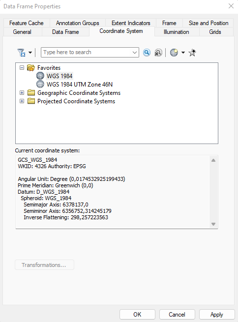 

Tambahkan beberapa data ke halaman kerja. Untuk menambahkan data-data dapat dilihat [**disini**](http://samsulmuarrif.me/blog/cara-menambahkan-shapefile-atau-raster-ke-halaman-kerja/).

 

### 2. Merapikan Halaman *Layout*

Pada halaman kerja, di bagian bawah pilih menu seperti pada gambar ini.

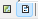 

Maka kita akan diarahkan pada halaman *Layout*, seperti gambar ini.

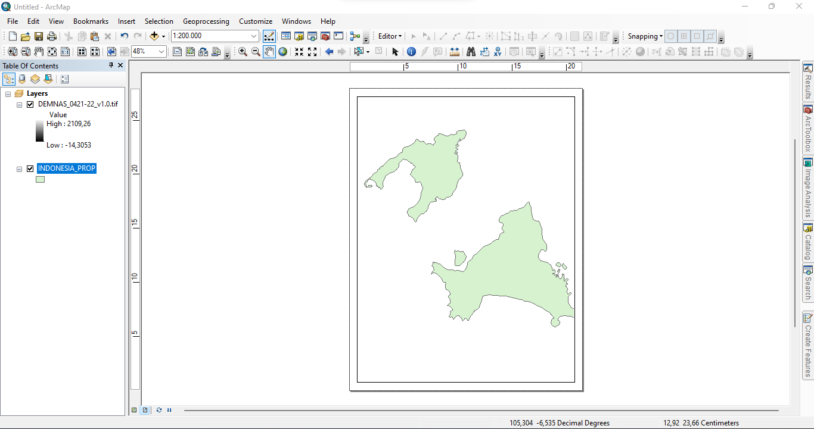 

Kita dapat menyesuaikan halaman yang akan di export dengan cara pilih Menu **File** dan pilih *Page and Print Setup*, seperti gambar ini.

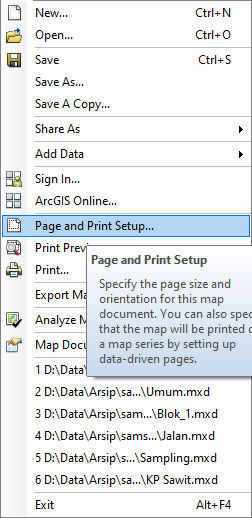 

Selanjutnya akan keluar jendela Page and Print Setup seperti di bawah. Kita dapat menentukan ukuran dan orientasi map. Selain itu juga dapat menentukan ukuran kostum dengan menghapus centang pada bagian *Use Printer Paper Settings* dan menentukan sesuai yang diinginkan pada bagian *weight* dan *height*.

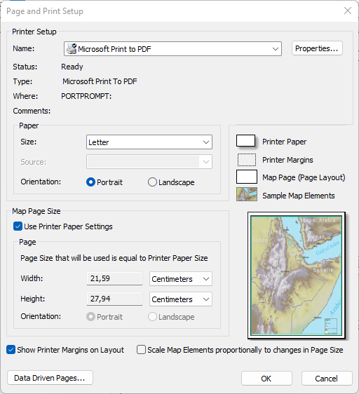 

Berikut adalah tampilan hasil penyesuaian ukuran map yang akan di export.

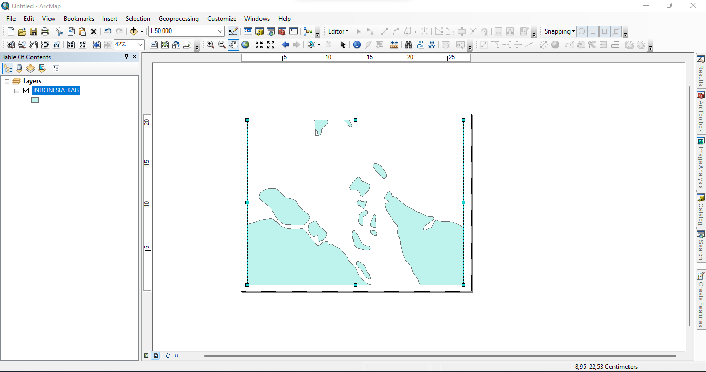 

Selanjutnya kita akan meng-export map dengan cara pilih *File* dan pilih *Export Map*, seperti gambar ini. 

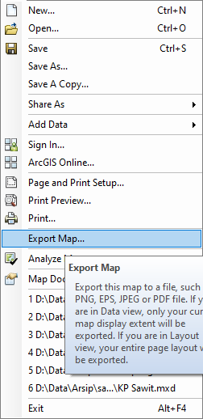 

Maka akan keluar jendala Export Map, disini kita dapat memilih *Save as type*, seperti pada gambar ini.

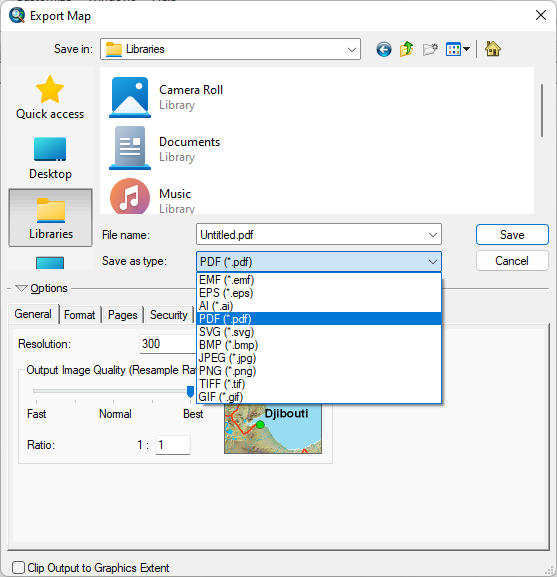 

### 3. Export Format PDF

Kita dapat meng-export map dalam bentuk .pdf. Dengan mengekspor sebagai pdf kita dapat menggunakan file tersebut pada aplikasi pemetaan yang mendukung pdf seperti Avenza Maps.

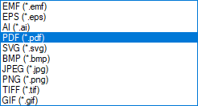 

Untuk mengekspor ke pdf pilih *.pdf*, seperti gambar ini.

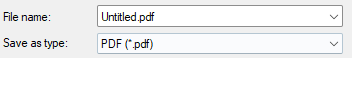 

Kemudian kita dapat mengatur resolusi dari pdf yang akan dihasilkan, seperti gambar ini.

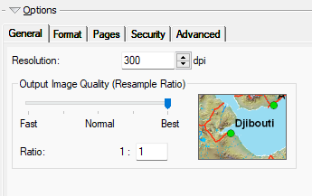 

### 4. Export Format JPEG

Kita dapat meng-export map dalam bentuk *.jpeg* untuk dapat digunakan dalam dokumen seperti ms word. Pada bagian *Save as type* kita dapat memilih **JPEG(*.jpg)** untuk mengekspor dengan format JPEG.

 

Apabila kita mengekspor dalam format JPEG kita dapat menentukan resolusi map yang akan dihasilkan

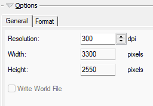 

dan dapat juga menentukan *Color Mode* apakah *24-bit True Color* atau *8-bit Grayscale*, seperti gambar ini.

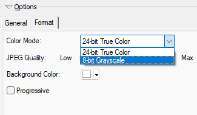 

Berikut adalah map hasil ekspor dengan format JPEG.

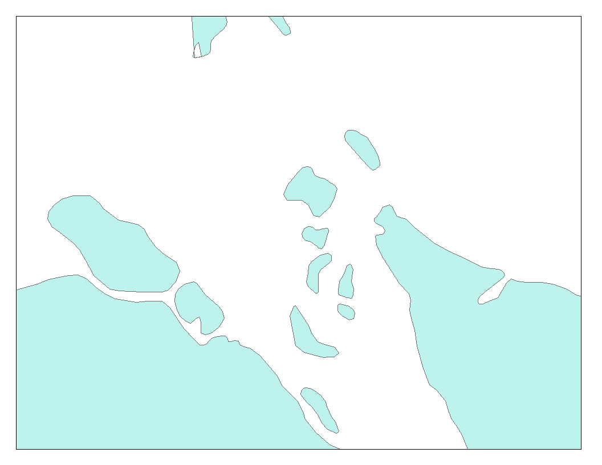 

 

Terima kasih telah membaca artikel ini.

