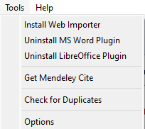

 

**Daftar Pustaka** merupakan bagian yang penting pada sebuah karya tulis. Daftar Pustaka biasanya berisi informasi tentang sumber-sumber yang digunakan dalam membuat karya tulis. Struktur dari Daftar Pustaka umumnya terdiri dari nama pengarang, judul tulisan, tahun, dan penerbit. Pada beberapa aplikasi penulisan Daftar Pustaka dapat dilakukan secara otomatis, seperti aplikasi *Mendeley*. Aplikasi ini dapat membuat Daftar Pustaka secara otomatis, namun kita harus menginput referensinya terlebih dahulu ke dalam aplikasi mendeley dengan cara menambahkan file pdf yang digunakan sebagai referensi. Berikut akan dibahas cara menggunakan aplikasi mendeley untuk membuat Daftar Pustaka secara otomatis.

 

### Install Mendeley

Tentunya kita harus memilki terlebih dahulu aplikasi mendeley tersebut dan aplikasi ini gratis, dalam hal ini kita menggunakan aplikasi **Mendeley Desktop** untuk windows yang dapat didownload [disini](https://www.filehorse.com/download-mendeley-desktop/), setelah di download maka selanjutnya kita harus menginstallnya di komputer. Setelah selesai di install kita dapat menggunakan aplikasi tersebut.

 

### Menambahkan Referensi/Add reference

Langkah selanjutnya adalah menambahkan referensi yang akan digunakan sebagai daftar pustaka pada tulisan yang akan kita buat. Hal ini dapat dilakukan dengan melakukan *Add Files* atau *Add Folder* pada aplikasi mendeley. Pilih *Toolbar File* atau menggunakan menu

 

Kemudian kita dapat menambahkan referensi tersebut di dalam aplikasi Microsoft Word dengan menginstall plugin mendeley di aplikasi Microsoft Word. Plugin tersebut dapat diinstall dengan cara mengklik Toolbar Tools pada aplikasi Mendeley kemudian pilih Install MS Word Plugin, seperti pada gambar  dibawah ini

 

### Menambahkan Sitasi ke dalam tulisan/Insert citation

Setelah Plugin terintall maka kita akan melihat menu tambahan pada aplikasi Microsoft Word seperti gambar berikut

 

Pada Toolbar References terdapat menu Mendeley Cite-O-Matic dan didalamnya terdapat menu Insert Citation

 

Menu ini dapat kita manfaatkan untuk menambahkan referensi ke dalam karya tulis kita. Klik pada menu tersebut maka akan muncul searchbar untuk memilih referensi yang telah kita tambahkan pada aplikasi mendeley desktop kita. Seperti gambar di bawah

 

Setelah mendapatkan referensi yang diinginkan, kemudian klik ok. Referensi-referensi yang kita tambahkan inilah yang nantinya akan menjadi daftar pustaka pada karya tulis kita. Dengan menggunakan aplikasi Mendeley Desktop ini maka kita dapat dengan sangat mudah membuat Daftar Pustaka tersebut.
 
 

### Membuat Daftar Pustaka/Insert bibliografi

Sebagaimana dijelaskan sebelumnya bahwa dengan aplikasi mendeley ini kita dapat dengan mudah membuat daftar pustaka. Caranya adalah dengan mengklik pada toolbar references pada aplikasi Microsoft Word kemudian pilih Insert Bibliogragpy seperti pada gambar di bawah

 

Sebelum mengklik pada menu tersebut, pastikan kita meletakkan kursor pada halaman yang kita inginkan untuk membuat daftar pustaka. Selanjutnya, aplikasi Mendeley Desktop akan secara otomatis membuatkan daftar pustaka pada karya tulis kita.

Membuat daftar pustaka tidak lagi menjadi hal yang menyebalkan dengan adanya aplikasi Mendeley sangat membantu kita dalam membuat Daftar Pustaka Secara Otomatis.

 

Demikianlah langkah-langkah dalam membuat Daftar Pustaka secara otomatis, semoga tulisan ini dapat bermanfaat dalam membuat sebuah karya tulis.

 

Untuk lebih jelas mengenai Cara Membuat Daftar Pustaka Otomatis dengan Mendeley Desktop pada MS Word silahkan lihat video berikut:

<iframe width="640" height="360" src="https://www.youtube.com/embed/ZxPi82Wklu8" title="Mendeley | Cara Membuat Dapus Otomatis Ms Word melalui Insert Referensi + Mendeley Desktop" frameborder="0" allow="accelerometer; autoplay; clipboard-write; encrypted-media; gyroscope; picture-in-picture" allowfullscreen></iframe>

 

Terima kasih telah membaca artikel ini.

