 

 [***Google Dokumen***](https://www.google.com/intl/id/docs/about/) adalah sebuah layanan pengolah kata, yang merupakan salah satu bagian dari suite Google Docs Editors dari Google, yang juga terdiri dari Google Sheets, Google Slides, Google Drawings, Google Formulir, Google Sites, dan Google Keep. Google Dokumen dapat diakses dengan sebuah peramban web sebagai sebuah aplikasi berbasis web. Google Dokumen juga tersedia dalam bentuk aplikasi seluler di Android dan iOS, dan sebagai aplikasi desktop pada Chrome OS [(Wikipedia)](https://id.wikipedia.org/wiki/Google_Dokumen). 

 
Cara untuk membuat file dokumen tersebut akan dijelaskan sebagai berikut.

 

### 1. Login ke Akun Email Google

Login ke akun [*email Google*](https://mail.google.com/) dapat dilakukan melalui browser sepert chrome, mozila, edge, opera, dll.

 

### 2. Membuat file dokumen baru

File dokumen baru dapat dibuat dengan cara mengklik menu titik sembilan di samping foto profil.

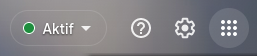 

Kemudian pilih menu dokumen.

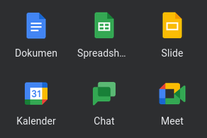 

### 3. Mengikuti tur Google Dokumen

Ketika pertama kali membuka Google Dokumen kita akan ditawarkan tur dari google.

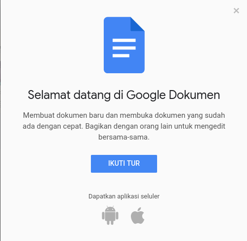     

Kita akan diberitahu untuk memulai dokumen baru.

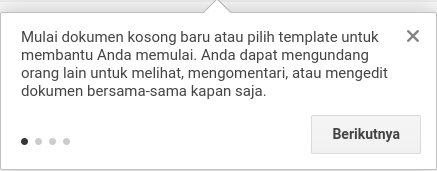 

Kita akan diarahkan untuk melihat folder dari google drive.

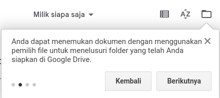 

Kita akan diarahkan pada bar pencarian untuk mencari file.

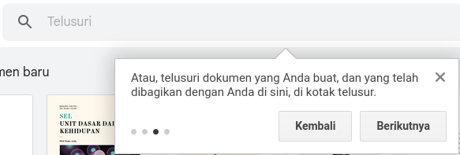 

Bagian terakhir akan diberitahu untuk membuka menu hamburger.

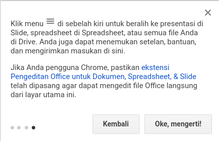 

Kita dapat mengklik ***Ok, mengerti!***  

### 4. Memulai dokumen baru

Kita dapat memilih untuk memulai dokumen kosong atau menggunakan template yang disediakan.

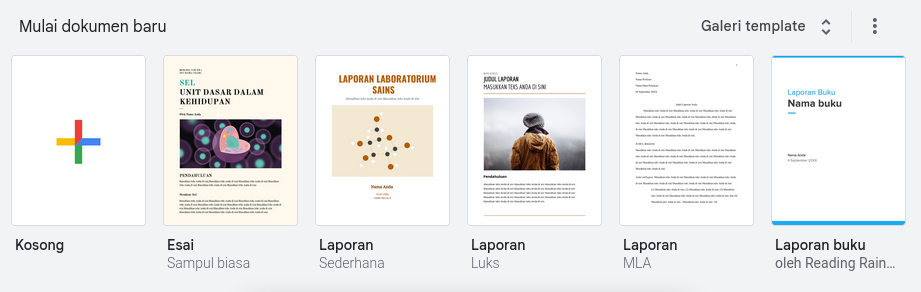 

Kita dapat memilih dokumen kosong dan berikut adalah tampilan awal dari dokumen konsong.

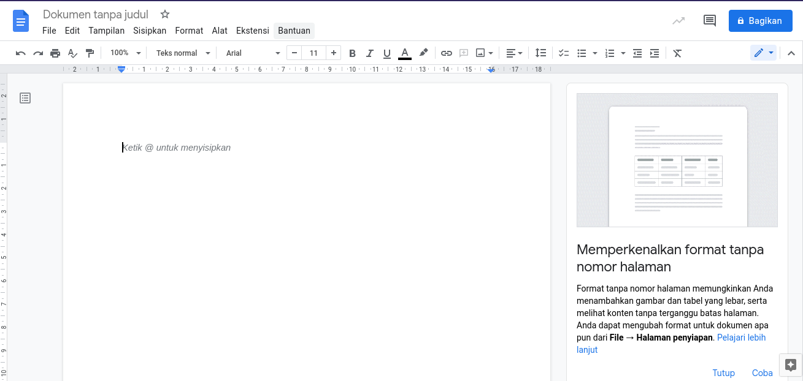 

Kemudian kita dapat menyesuaikan nama file dokumen pada bagian kiri atas sebagai berikut.

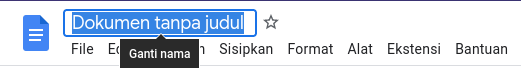 

Setelah menyesuaikan nama filenya, selanjutnya kita dapat membagikan file tersebut.

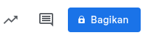 

Apabila kita membagikan file dokumen sebelum menyesuaikan nama filenya, maka kita akan diminta untuk menyesuaikan nama file tersebut.

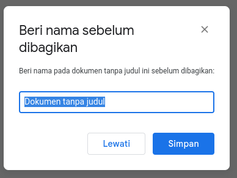 

Untuk dapat membagikan file tersebut sehingga dapat diedit secara online bersama-sama, kita perlu menambahkan alamat email yang ingin kita bagikan file tersebut. Kemudian kita menentukan status apakah sebagai dapat melihat atau sebagai editor.

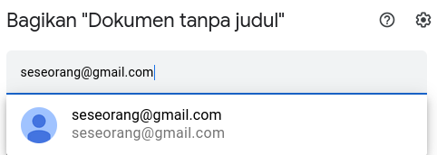 

Selain itu, kita dapat juga membagikan menggunakan link, dapat disesuaikan link yang akan dibagikan.

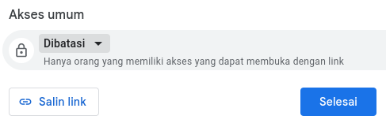 

 

Demikian cara membuat file dokumen yang dapat diedit bersama secara online.

 

Terima kasih telah membaca artikel ini.

