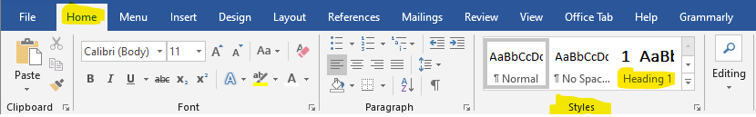
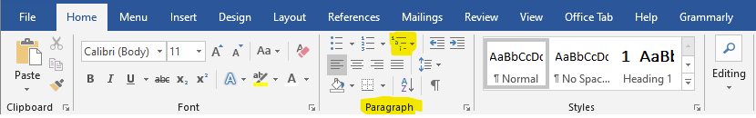
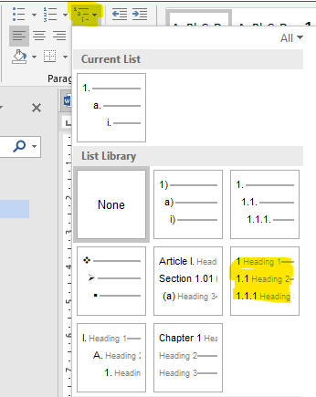
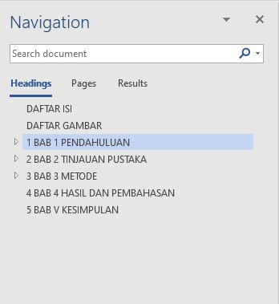
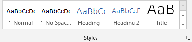
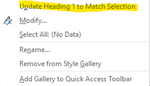

 

Membuat sebuah tulisan artikel merupakan hal yang banyak dilakukan di masa sekarang. Setiap orang memiliki caranya tersendiri dalam membuat sebuah artikel, namun cara yang paling umum diguanakan adalah dengan menggunakan aplikasi komputer seperti Microsoft word. Aplikasi ini memiliki banyak fitur yang dibutuhkan dalam membuat sebuah tulisan. Seperti fitur membuat *Heading*.

 

**Heading** merupakan fitur yang terdapat pada Microsoft Word yang mempermudah dalam pembuatan daftar isi dan juga dapat digunakan sebagai navigasi ringkas. Selain itu heading sangat mempermudah dalam mengatur style atau format dari tulisan yang kita buat menggunakan Microsoft Word. Kita tidak perlu mengatur judul bab satu persatu melainkan dapat diatur bersamaan dengan memanfaatkan fitur *Style Heading* ini.

 

Fitur ini akan sangat bermanfaat dalam membuat sebuah tulisan, karena dengan adanya fitur ini akan memudahkan penulis dalam mengatur style dari judul bab hingga sub bab. Selain itu, dengan adanya fitur ini akan memudahkan navigasi antar halaman bab dalam sebuah file Microsoft word. Berikut akan dijelaskan bagaimana cara menggunakan fitur heading pada Microsoft word:

  

### 1. Membuat Struktur Tulisan

Siapkan struktur tulisan yang akan digunakan, contoh sederhananya seperti berikut:

a. BAB I

b. BAB II

c. BAB III

 

### 2. Mengaktifkan Fitur Heading

Fitur ini sendiri terdapat pada tab *Home* pada aplikasi Microsoft Word, kemudian di *Styles* dan pilih **Heading**.

 

 

Sebelum menggunakan fitur ini, kita juga harus mengaktifkannya terlebih dahulu pada tab Home,

 

 

kemudian pada paragraf pilih pada *List Library* jenis Heading yang diinginkan, disarankan memilih seperti pada gambar di bawah.

 

 

Setelah mengaktifkan *List Library* kemudian kita dapat memilih **Heading** yang terdapat pada menu *Style*. Terdapat banyak *Style*, namun pada kasus ini kita menggunakan Heading 1, Heading 2, atau Heading 3. Judul Bab sebaiknya menggunakan Heading 1, dan judul subbab sebaiknya menggunakan Heading 2, dan seterusnya. Selanjutnya, setelah kita membuat *Heading*, kita dapat mengaktifkan *Navigation Pane* yang dapat memudahkan dalam navigasi berkas yang sedang kita kerjakan pada aplikasi Microsoft Word.

 

**Navigation Pane** dapat diaktifkan dengan cara membuka tab *View* kemudian centang *Navigation Pane*, seperti pada gambar di bawah. Maka, kita akan dapat melihat Navigation seperti di bawah, dimana terdapat tab menu Headings yang dapat digunukan untuk menavigasikan berkas yang sedang kita kerjakan dengan cara mengklik pada judul bab yang diinginkan.

 

 

### 3. Menentukan Level Struktur Sesuai Level Heading

Misalnya, judul bab sebagai heading satu, subbab heading dua, subsubbab sebagai heading tiga, dan seterusnya. Letakkan kursor pada judul bab yang diinginkan misalnya *BAB I*, kemudian pada toolbar *Home*, pada bagian **Styles** klik *Heading 1*.

 

 

### 4. Mengubah Style Heading

Selain dari format style yang telah disediakan dalam aplikasi Microsoft word, kita juga dapat mengubah style tersebut sesuai dengan yang diinginkan. Misalnya, mengubah font family, menjadikan bold, mengubah ukuran font, dll. Caranya sebagai berikut:

 

Atur sebuah judul bab atau subbab yang diinginkan. Kemudian letakkan kursor pada judul bab tersebut, selanjutnya pada toolbar Home pada bagian style klik kanan pada level heading yang sesuai (misalnya heading 1 judul bab, heading 2 subbab). Kemudian klik *update heading 1 to match selection*.

 

 

Selain dari itu juga masih terdapat menu-menu lain yang dapat digunakan dalam mengatur style heading sesuai dengan yang diinginkan.

Demikianlah cara membuat heading pada Microsoft word.

 

Untuk lebih jelas mengenai Cara Membuat Heading pada MS Word silahkan lihat video berikut:

<iframe width="640" height="360" src="https://www.youtube.com/embed/arbDZVNsop4" title="Ms Word | Part 1 Heading" frameborder="0" allow="accelerometer; autoplay; clipboard-write; encrypted-media; gyroscope; picture-in-picture" allowfullscreen></iframe>

 

Terima kasih telah membaca artikel ini.