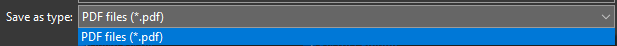

 

Portable Document Format (disingkat PDF) adalah sebuah format berkas yang dibuat oleh Adobe Systems pada tahun 1993 untuk keperluan pertukaran dokumen digital. Format PDF digunakan untuk merepresentasikan dokumen dua dimensi yang meliputi teks, huruf, citra dan grafik vektor dua dimensi [(***Wikipedia***)](https://id.wikipedia.org/wiki/Portable_Document_Format).

 

Terdapat banyak cara untuk membuat file pdf, salah satunya dengan aplikasi Adobe Acrobat. Kali ini kita akan membahas cara membuat pdf yang terdapat batasan akses terhadap isi filenya, seperti tidak bisa di-*copy*, di-*edit*, dll. PDF yang kita buat kali ini berasal dari dokumen yang kita buat dengan MS Word. Tentunya harus memiliki kedua aplikasi tersebut dan plugin Acrobat pada MS Word.

 

Berikut akan dijelaskan tahapan untuk membuat file pdf yang memiliki batasan akses dengan password.

 

### 1. Menyiapkan File Dokumen Word

File ini dapat disiapkan seperti biasanya kita menuliskan sebuah dokumen dengan ms word. Kemudian menyimpan file tersebut dengan format biasa, yaitu format *.doc* atau *.docx*.

 

### 2. Menyesuaikan Pengaturan PDF

Pada Menubar ms word arahkan pada menu Acrobat seperti gambar ini.

 

Kemudian pilih menu *Preferences*, seperti gambar ini.

 

Setelah terbuka jendela baru, arahkan pada tab *Security*, seperti gambar  ini.

 

Bagian atas jendela ini terdapat pengaturan untuk memberikan batasan penuh. Apabila kita menggunakan fitur ini maka untuk membuka filenya saja memerlukan password, kali ini kita tidak mengaktifkan fitur ini dengan tidak mencentang pada bagian ini.

 

Bagian selanjutnya adalah bagian yang akan kita sesuaikan untuk kebutuhan batasan akses pada file pdf kali ini.

 

Pastikan kita mencentang pada bagian seperti pada gambar ini.

 

Isiskan password sesuai dengan yang diinginkan. Pada bagian ini kita mulai memberikan batasan yang kita inginkan. Mulai dari membatasi resolusi untuk proses pencetakan file atau tidak memberikan izin untuk mencetak, seperti gambar ini.

 

Pilihan resolusi untuk proses cetak seperti yang terlihat pada gambar ini.

 

Kemudian untuk *Changes Allowed* atau perubahan yang diizinkan terdapat pilihan seperti gambar ini.

 

Jika kita ingin file pdf tidak dapat di-*copy* pastikan kita tidak mencentang pada bagian seperti gambar ini.

 

Bagian selanjutnya dapat disesuaikan sebagaimana mestinya.

 

Jika dirasa semuanya sudah beres maka kita dapat melanjutkan ke tahapan selanjutnya dengan mengklik **Ok** dan mengorfirmasi password seperti gambar ini.

 

### 3. Membuat File PDF

Setelah mengorfirmasi password pilih menu Create PDF seperti gambar ini.

 

Apabila kita membuat pdf sebelum menyimpan file dokumen maka akan diminta untuk menyimpannya terlebih dahulu dalam forma ms word, seperti gambar ini.

 

Kemudian kita akan menyimpan file dalam format *.pdf*, seperti gambar ini.

 

Pastikan **Restrict Editing** tercentang, seperti gambar ini.

 

Klik **Ok**, maka akan keluar jendela *process bar* seperti ini.

 

Selanjutnya, tinggal menunggu hingga proses selesai. Jika sudah selesai kita dapat melihat tanda (SECURED) pada file pdf yang dibuka, seperti gambar di bawah ini.

 

Dengan demikian kita telah berhasil membuat file PDF yang memiliki batasan akses dengan password.

 

Terima kasih telah membaca artikel ini.