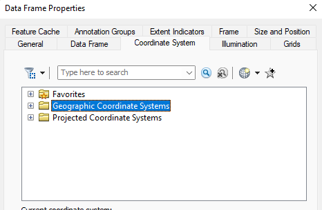
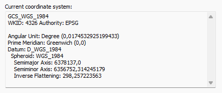

 

 Sebuah **shapefile** biasanya terdiri dari kumpulan file yang berekstensi *". shp", ". shx", ". dbf"*, dan ekstensi lainnya pada sebuah nama yang sama (e.g. , "jalan. *"). Saat penggunaan, shapefile sebenarnya yang rujuk adalah yang berekstensi **". shp"**, namun file ini tidak lengkap dan membutuhkan file lainnya [(DBPedia)](http://id.dbpedia.org/page/Shapefile). **Raster** merupakan data yang dapat berbentuk gambar atau pun citra. Raster dalam pemetaan dapat berupa gambar rupa bumi, data ketinggian seperti dem dan lain-lain.
 
Cara untuk menambahkan data-data tersebut ke dalam halaman kerja ArcMap akan dijelaskan sebagai berikut.

 

### 1. Membuat Halaman Kerja Baru

Membuat halaman kerja baru dengan cara klik menu **File** kemudian New atau menggunakan shortcut *Ctrl + N*.

 

### 2. Menentukan Format Koordinat

Menentukan koordinat yang akan digunakan dengan cara sebagai berikut:

a. Aktifkan *Table Of Contents* dengan cara klik menu **Windows** kemudian klik *Table Of Contents*

 

b. Pada panel *Table of Contents* klik kanan pada **Layers** dan pilih *Properties*

 

c. Pada jendela properties pilih *Coordinate System, Geographic Coordinate Systems, World, WGS 1984.* Dapat juga dipilih sesuai dengan yang diinginkan.

 

### 3. Menambahkan data-data

 

Terima kasih telah membaca artikel ini.

