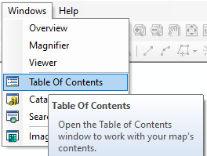
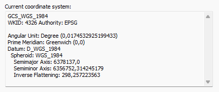

 

**Shapefile** *ESRI* atau biasa disebut *shapefile* adalah format data geospasial yang umum untuk perangkat lunak sistem informasi geografis. Dikembangkan dan atur oleh ESRI sebagai spesifikasi (hampir) terbuka untuk interoperabilitas data antara ESRI dan produk perangkat lunak lainnya. Sebuah **"shapefile"** biasanya terdiri dari kumpulan file yang berekstensi *". shp", ". shx", ". dbf"*, dan ekstensi lainnya pada sebuah nama yang sama (e.g. , "jalan. *"). Saat penggunaan, shapefile sebenarnya yang rujuk adalah yang berekstensi **". shp"**, namun file ini tidak lengkap dan membutuhkan file lainnya. Shapefile keruangan digambarkan dengan geometri: titik, garis, dan luasan. Geometri tersebut, sebagai contoh, dapat mewakili pancuran, sungai, dan danau. Tiap bagian memiliki atribut yang menjelaskan atribut tersebut, seperti nama sungai atau temperatur (<a href="http://id.dbpedia.org/page/Shapefile" target="_blank">DBPedia</a>).
 
Berikut beberapa hal yang perlu dilakukan sebelum membuat shapefile ketika membuat peta ataupun digitasi.

 

### 1. Membuat Halaman Kerja Baru

Membuat halaman kerja baru dengan cara klik menu **File** kemudian New atau menggunakan shortcut *Ctrl + N*.

 

### 2. Menentukan Format Koordinat

Menentukan koordinat yang akan digunakan dengan cara sebagai berikut:

a. Aktifkan *Table Of Contents* dengan cara klik menu **Windows** kemudian klik *Table Of Contents*

 

b. Pada panel *Table of Contents* klik kanan pada **Layers** dan pilih *Properties*

 

c. Pada jendela properties pilih *Coordinate System, Geographic Coordinate Systems, World, WGS 1984.* Dapat juga dipilih sesuai dengan yang diinginkan.

 

### 3. Mengaktifkan Toolbar Editor

Aktifkan toolbar *Editor* dengan cara klik menu *Customize, Toobars,* dan select **Editor**.

 

### 4. Membuat Shapefile

Membuat file *.shp* sesuai yang diinginkan dengan cara sebagai berikut:

a. Aktifkan toolbars *Standard* dengan cara klik menu *Customize, Toolbars,* dan select **Standard**.

 

b. Pada toolbars Standard klik icon
 

c. Pilihlah folder yang akan digunakan untuk menyimpan file *.shp* tersebut, kemudian klik kanan pada folder tersebut lalu pilih **New -> Shapefile**.

 

d. Sesuaikan informasi mengenai shapefile tersebut sesuai yang diinginkan.

 

### 5. Start Editing

Memulai editing *shapefile* atau *digitasi* dengan cara sebagai berikut:

a. Klik *Editor* pada toolbar *Editor* dan pilih **Start Editing**. Hal ini akan mengaktifkan seluruh tool pada toolbar *Editor*.

 

b. Untuk memulai digitasi kita harus memilih tool **Create Features**.

 

c. Pilih shapefile yang akan diedit dan select tool sesuai dengan yang diperlukan pada panel *Create Features*.

 

Dengan demikian kita sudah siap untuk melakukan digitasi ataupun **edit Shapefile (.shp)**.

 

Terima kasih telah membaca artikel ini.

