 

Open Journal Systems (OJS) adalah aplikasi perangkat lunak open source untuk mengelola dan menerbitkan jurnal ilmiah. Awalnya dikembangkan dan dirilis oleh PKP pada tahun 2001 untuk meningkatkan akses ke penelitian, ini adalah platform penerbitan jurnal sumber terbuka yang paling banyak digunakan, dengan lebih dari 25.000 jurnal menggunakannya di seluruh dunia [**(PKP)**](https://pkp.sfu.ca/ojs/).

 

OJS adalah perangkat lunak gratis dan open source yang dirilis di bawah lisensi open source GPL v2. Anda bebas [*mengunduh*](https://pkp.sfu.ca/ojs/ojs_download/), menggunakan, dan memodifikasinya tanpa biaya. OJS tersedia secara gratis untuk jurnal di seluruh dunia dengan tujuan menjadikan penerbitan akses terbuka sebagai pilihan yang layak untuk lebih banyak jurnal, karena akses terbuka dapat meningkatkan jumlah pembaca jurnal serta kontribusinya untuk kepentingan publik dalam skala global [**(PKP)**](https://pkp.sfu.ca/ojs/).

 

Berikut akan dijelaskan tahapan-tahapan untuk menginstall aplikasi ojs pada server local.

 

### 1. Menyiapkan *local server* dengan XAMPP

*Local server* dapat dibangun atau di *setup* menggunakan aplikasi sepert XAMPP. [*Download*](https://www.apachefriends.org/download.html) dan install aplikasi XAMPP di komputer yang akan digunakan untuk menginstall OJS.

 

### 2. Menyiapkan file instalasi OJS 3.x

OJS 3.x dapat di [**download**](https://pkp.sfu.ca/ojs/download/ojs-3.3.0-12.tar.gz) pada web PKP. Setelah di download ekstrak dengan aplikasi ekstraktor seperti WinRAR atau WinZIP.

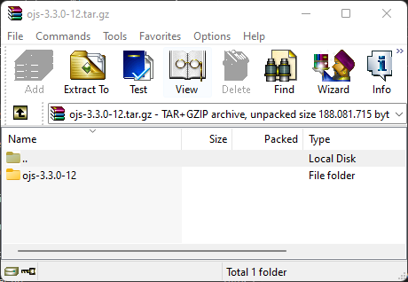 

Kemudian, pindahkan folder yang telah diekstrak ke dalam folder **htdocs** yang terdapat di dalam XAMPP. Untuk lebih memudahkan ubah nama folder menjadi *ojs* saja. Seperti pada gambar ini.

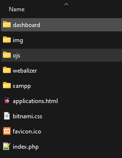 

### 3. Persiapan instalasi melalui webbrowser

Buka aplikasi XAMPP dan aktifkan *apache* dan *MySQL*, tunggu hingga bewarna hijau.

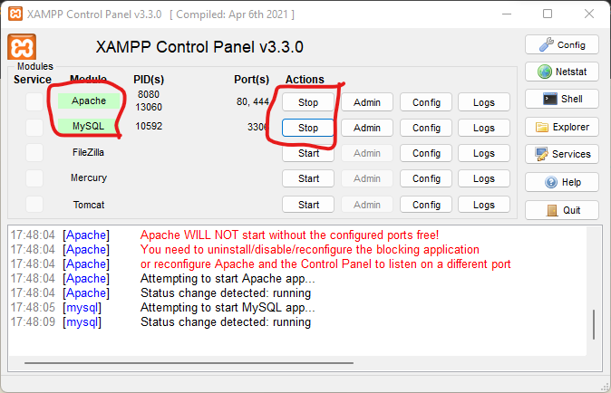 

Selanjutnya, buka browser dan ketikkan link *localhost/ojs*, tunggu hingga linknya berubah menjadi seperti gambar ini.

 

Jika, halaman browser terlihat seperti gambar di bawah ini, maka proses instalasi siap dilanjutkan melalui browser.

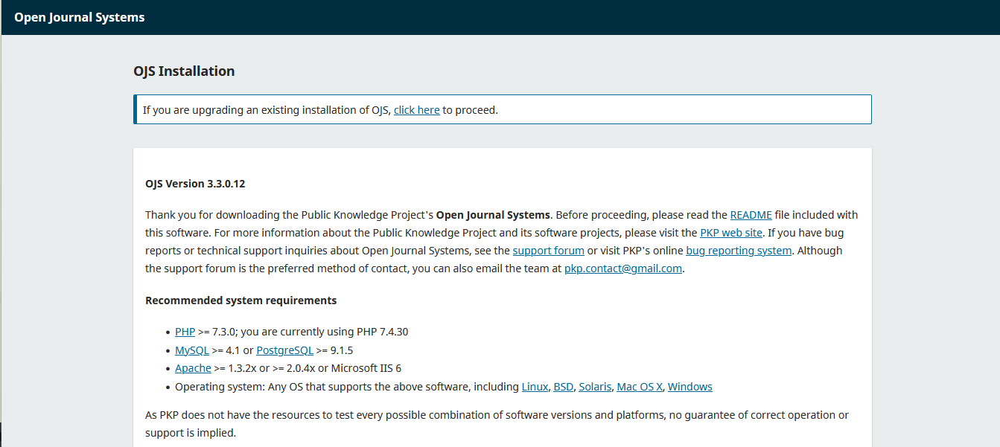 

### 4. Proses instalasi melalui webbrowser

Buat akun admin sesuai dengan form yang diminta seperti pada gambar ini.

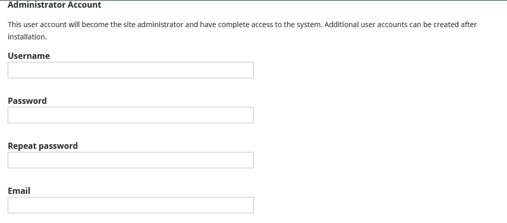 

Buat folder baru di dalam folder xampp yang akan digunakan sebagai folder penyimpanan file-file yang di-*upload* melalui ojs. Seperti gambar ini.

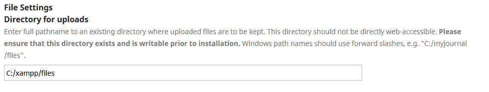 

Buat sebuah database baru di MySQL dengan cara ketikkan link seperti gambar ini.

 

Maka akan muncul halaman seperti gambar ini, lalu pilih *New*.

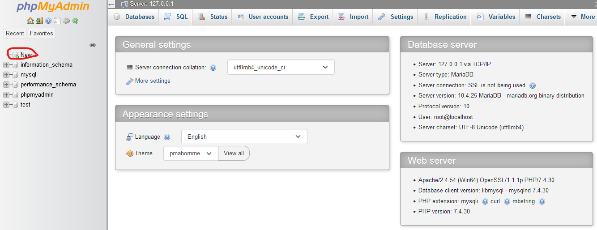 

Kemudian isikan nama database seperti pada gambar ini.

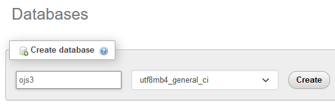 

Jika sudah selesai akan terlihat seperti pada gambar ini.

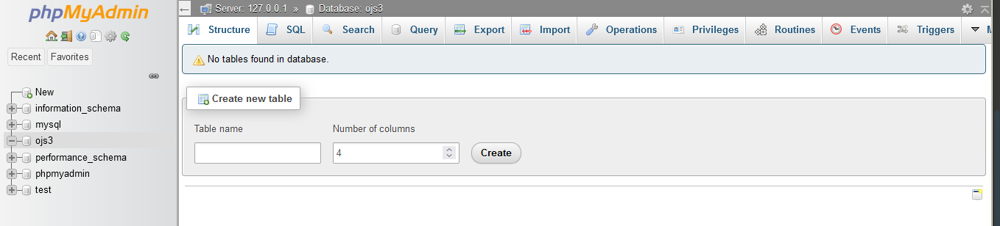 

Selanjutnya, kembali ke halaman instalasi ojs dan sesuaikan driver database sesuai dengan yang sudah kita buat sebelumnya. Seperti pada gambar ini.

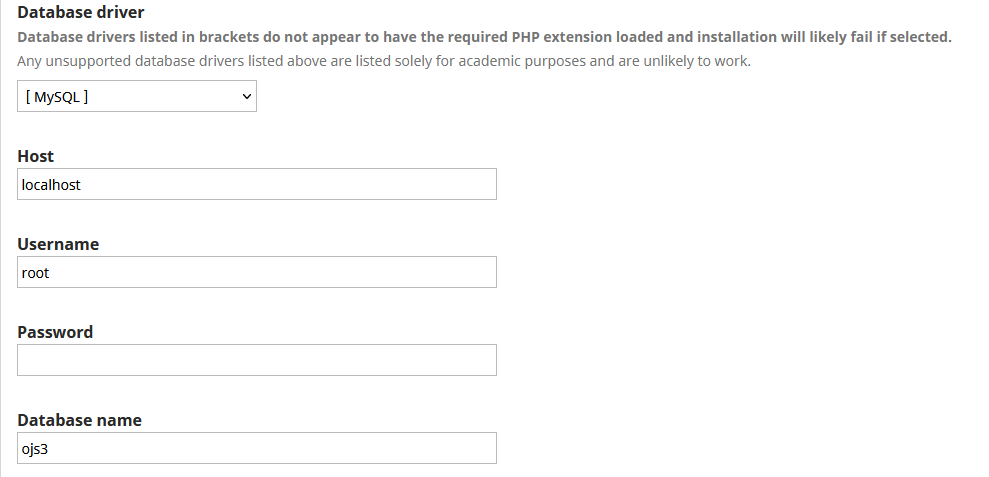 

Terakhir, pada bagian kanan bawah klik ***Install Open Journal Systems***.

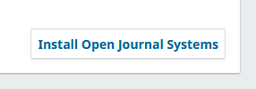 

### 5. Memastikan proses instalasi berhasil

Jika sudah berhasil terinstall maka kita akan melihat halaman seperti pada gambar ini.

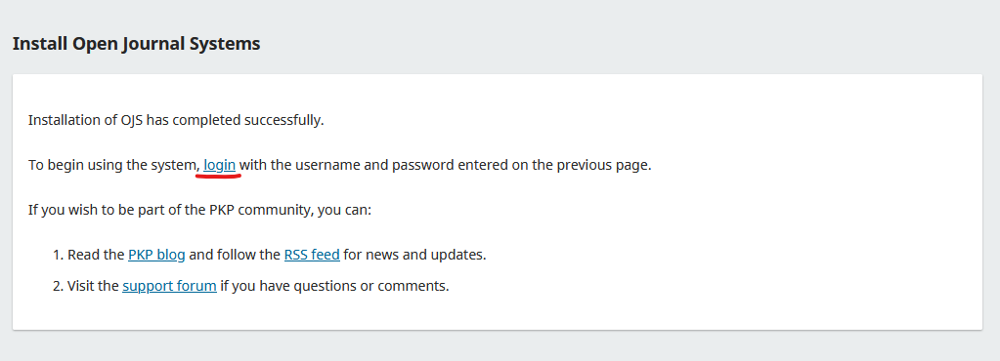 

Dengan demikian kita sudah menyelesaikan seluruh tahapan install ojs 3.x pada *localhost* menggunakan Windows.

 

Selanjutnya kita dapat login dengan akun admin yang telah di buat pada proses instalasi sebelumnya pada halaman login seperti pada gambar ini.

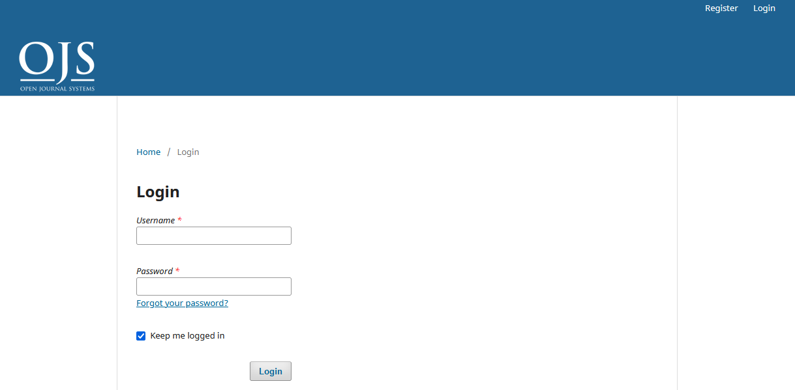 

 

Terima kasih telah membaca artikel ini.